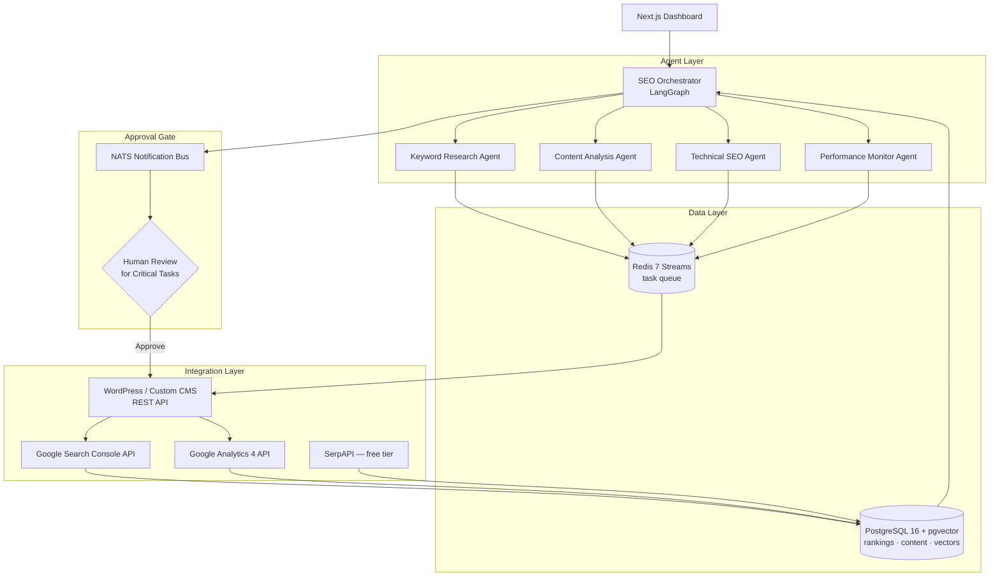

# SEO Automation Platform — Architecture Specification

## Overview

A multi-agent AI system that autonomously manages end-to-end SEO for 2–3 WordPress and custom CMS websites. The platform replaces manual SEO workflows with a conservative, always-on automation pipeline while preserving human approval gates for high-risk actions.

## System Topology



## Component Responsibilities

| Component | Technology | Role |
|-----------|-----------|------|
| SEO Orchestrator | LangGraph + Claude Sonnet 4 | Central planner, task routing, state management |
| Keyword Research Agent | Python + Google Trends API (free) | Keyword clustering, intent classification |
| Content Analysis Agent | LlamaIndex + pgvector | Semantic gap analysis, on-page optimization |
| Technical SEO Agent | Playwright + Lighthouse CI | Core Web Vitals, crawlability, schema markup |
| Performance Monitor Agent | SerpAPI + TimescaleDB | Ranking tracking, algorithm-change detection |
| Data Layer | PostgreSQL 16 + pgvector + Redis 7 | Persistent storage, vector search, task queue |
| CMS Integration Hub | WordPress REST API + Custom adapters | Automated content and meta-tag publishing |
| Web Interface | Next.js 14 + shadcn/ui | Dashboard, approvals, reporting |
| Notifications | NATS.io | Low-latency human-approval alerts |

## Infrastructure

Deployed on a single machine or low-cost VPS using **Docker Compose** (sufficient for 2–3 sites). No Kubernetes overhead. All services containerized; volumes used for persistence.

```
docker-compose.yml
├── orchestrator   (Python/LangGraph)
├── agents         (Python workers)
├── postgres       (PostgreSQL 16 + pgvector)
├── redis          (Redis 7)
├── nats           (NATS.io)
└── web            (Next.js 14)
```

## Human Approval Gates

The following actions are **blocked until human approval** via the dashboard:

- Publishing new or modified page content
- Removing existing content or redirects
- Creating external outreach emails
- Modifying site-wide structural settings (sitemap, robots.txt)

All other actions (metric collection, gap analysis, draft generation, rank tracking) run autonomously.

## Data Flow Summary

1. **Ingest** — GSC, GA4, and SERP data collected on a schedule → stored in PostgreSQL  
2. **Analyse** — Agents query the data lake and vector store for insights  
3. **Plan** — Orchestrator produces an ordered task list via LangGraph state machine  
4. **Execute** — Non-critical tasks auto-run; critical tasks enter NATS approval queue  
5. **Learn** — Outcome metrics feed back into PostgreSQL for continuous improvement  

## Security Posture

- All API keys stored in `.env` files, never committed (`.gitignore` enforced)
- Rate limiting on all outbound calls to avoid search engine penalties
- RBAC on the Next.js dashboard (NextAuth.js with credential provider)
- Audit log table in PostgreSQL for every automated action
