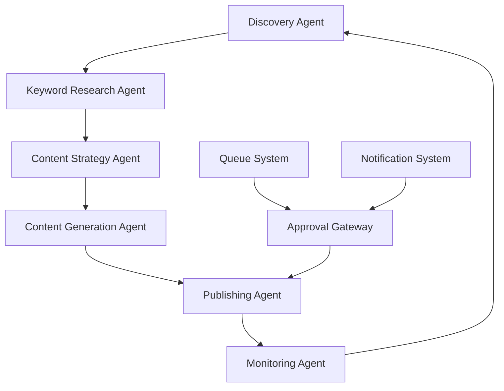

# SEO Automation Platform

A comprehensive multi-agent AI system that automates SEO workflows for WordPress and custom CMS websites. Built with production-grade infrastructure using LangGraph for agent orchestration, PostgreSQL with TimescaleDB for time-series analytics, Redis Streams for task queuing, and NATS JetStream for human approval workflows.

[](./scripts/validate-phase1.py)
[](https://www.python.org/downloads/)
[](https://www.docker.com/)

## 🏗️ Architecture Overview

### Core Infrastructure Stack

- **🤖 Agent Orchestration**: LangGraph for multi-agent workflows
- **📊 Database**: PostgreSQL 16 + TimescaleDB + pgvector for time-series and vector data
- **⚡ Task Queue**: Redis 7 Streams for reliable task processing
- **🔔 Notifications**: NATS JetStream for human approval workflows
- **🌐 Web Dashboard**: Next.js 14 + shadcn/ui (Phase 2)
- **🐳 Deployment**: Docker Compose for local and production environments

### Database Schema (6 Core Tables)

| Table | Purpose | Type |
|-------|---------|------|
| `sites` | Website management and CMS integration | Standard |
| `keywords` | Target keywords with semantic embeddings | Standard |
| `audit_log` | Action tracking and approval workflows | Standard |
| `rankings` | Daily SERP position tracking | TimescaleDB Hypertable |
| `gsc_metrics` | Google Search Console metrics | TimescaleDB Hypertable |
| `ga4_metrics` | Google Analytics 4 metrics | TimescaleDB Hypertable |

### Agent System



## 🚀 Quick Start

### Prerequisites

- **Python**: 3.11+ with pip
- **Docker**: 20.10+ with Docker Compose
- **System**: 8GB+ RAM, 10GB+ disk space

### 1. Environment Setup

```bash
# Clone repository
git clone <repository-url>
cd seo-automation-platform

# Install dependencies
make install-dev

# Copy environment template
cp .env.example .env
# Edit .env with your configuration (see Environment Variables section)
```

### 2. Infrastructure Setup

```bash
# Start all services and run complete setup
make setup

# This command will:
# - Start Docker Compose services (PostgreSQL, Redis, NATS)
# - Run database migrations
# - Validate all components
# - Display health status
```

### 3. Validate Installation

```bash
# Run comprehensive Phase 1 validation
make validate

# Expected output: ✅ Phase 1 validation PASSED
```

## 🛠️ Developer Commands

### Infrastructure Management

```bash
make start              # Start Docker services
make stop               # Stop Docker services  
make restart            # Restart Docker services
make logs               # View all service logs
make health             # Check service health
make status             # Show system status
```

### Database Management

```bash
make migrate            # Run database migrations
make migrate-rollback   # Rollback migrations (⚠️ destructive)
make shell-postgres     # Open PostgreSQL shell
make backup-db          # Create database backup
```

### Validation & Testing

```bash
make validate           # Full Phase 1 validation
make test               # Run all tests
make test-unit          # Run unit tests only
make test-integration   # Run integration tests
make test-coverage      # Run with coverage report
```

### Development Workflow

```bash
make dev-cycle          # Format + lint + type-check + unit tests
make pre-commit         # Pre-commit validation
make ci-test           # Full CI/CD test suite
```

### Code Quality

```bash
make format            # Format code with Black
make lint              # Lint with Ruff  
make check-types       # Type checking with mypy
make check             # Run all quality checks
```

## 🔧 Configuration

### Environment Variables

#### Required Variables

```bash
# Database Configuration
POSTGRES_HOST=localhost
POSTGRES_PORT=5432
POSTGRES_DB=seo_platform
POSTGRES_USER=seo
POSTGRES_PASSWORD=your_secure_password

# Redis Configuration  
REDIS_HOST=localhost
REDIS_PORT=6379

# NATS Configuration
NATS_HOST=localhost
NATS_PORT=4222
```

#### Optional Variables

```bash
# Application Settings
ENVIRONMENT=development  # development|staging|production
DEBUG=false
LOG_LEVEL=INFO          # DEBUG|INFO|WARNING|ERROR

# TimescaleDB Settings
TIMESCALEDB_ENABLED=true
TIMESCALE_CHUNK_TIME_INTERVAL=7d

# Rate Limiting
RATE_LIMIT_REQUESTS_PER_MINUTE=60
RATE_LIMIT_BURST_SIZE=10
```

### Service Configuration Files

- `docker-compose.yml` - Docker service definitions
- `alembic.ini` - Database migration configuration
- `redis/redis.conf` - Redis configuration
- `nats/nats.conf` - NATS server configuration
- `config/settings.py` - Application settings with Pydantic validation

## 📊 Health Monitoring

### Health Check Endpoints

```bash
# Basic health check
make health

# Detailed health check with verbose output
python scripts/health-check.py --verbose

# JSON output for monitoring systems
python scripts/health-check.py --json-only
```

### Service Status Indicators

- **✅ Healthy**: All services operational
- **⚠️ Degraded**: Some features limited but core functionality available  
- **❌ Unhealthy**: Critical services down

### Performance Baselines

After running `make validate`, baseline metrics are recorded:

- PostgreSQL query time: ~1-5ms
- Redis publish latency: ~0.5-2ms
- NATS roundtrip time: ~1-3ms
- Migration upgrade time: ~100-500ms
- Vector similarity query: ~2-10ms

## 🧪 Testing Strategy

### Test Categories

| Type | Marker | Purpose | Requirements |
|------|--------|---------|--------------|
| Unit | `@pytest.mark.unit` | Fast, isolated tests | None |
| Integration | `@pytest.mark.integration` | Service integration | Docker services |
| E2E | `@pytest.mark.e2e` | Full system tests | All services + data |
| Performance | `@pytest.mark.slow` | Performance validation | Production-like load |

### Running Tests

```bash
# Development cycle (fast feedback)
make test-unit

# Full validation (before commits)  
make test-integration

# Production readiness
make test-coverage
```

## 📁 Project Structure

```
seo-automation-platform/
├── agents/                 # LangGraph agent implementations
│   ├── base.py            # Base agent interface
│   ├── discovery.py       # Website discovery agent
│   └── keyword.py         # Keyword research agent
├── config/                # Configuration management
│   └── settings.py        # Pydantic settings
├── db/                    # Database layer
│   ├── models.py          # SQLAlchemy ORM models
│   ├── migrations/        # Alembic database migrations
│   └── connection.py      # Database connection management
├── integrations/          # External API integrations  
│   ├── gsc/              # Google Search Console
│   ├── ga4/              # Google Analytics 4
│   ├── serp/             # SerpAPI for SERP data
│   └── utils/            # Shared integration utilities
├── task_queue/            # Redis Streams task processing
│   ├── producer.py        # Task publishing
│   └── consumer.py        # Task consumption
├── notifications/         # NATS approval workflows
│   ├── publisher.py       # Approval request publishing
│   └── subscriber.py      # Approval response handling
├── scripts/               # Utility and validation scripts
│   ├── health-check.py    # Infrastructure health validation
│   ├── validate-phase1.py # Comprehensive Phase 1 validation
│   └── README.md          # Script documentation
├── tests/                 # Test suite
│   ├── unit/             # Unit tests
│   ├── integration/      # Integration tests
│   └── fixtures/         # Test data fixtures
├── docker-compose.yml     # Docker service definitions
├── alembic.ini           # Database migration configuration
├── Makefile              # Developer commands
└── requirements.txt      # Python dependencies
```

## 🔒 Security & Production Considerations

### Security Best Practices

1. **Environment Variables**: All secrets via environment variables, never hardcoded
2. **Database Security**: Parameterized queries only, no string interpolation
3. **API Rate Limiting**: All external API calls rate-limited
4. **Approval Gates**: Human approval required for all CMS write operations
5. **Audit Logging**: Complete audit trail of all automated actions

### Production Deployment

1. **Resource Requirements**: 
   - CPU: 4+ cores recommended
   - RAM: 16GB+ for full system
   - Storage: 100GB+ SSD for time-series data

2. **Monitoring**: 
   - Health checks every 30 seconds  
   - Performance baseline monitoring
   - Alert on service degradation

3. **Backup Strategy**:
   - Database: Daily automated backups
   - Configuration: Version-controlled environments
   - Recovery: Tested restore procedures

## 🛣️ Development Roadmap

### ✅ Phase 1: Foundation Infrastructure (Current)
- Core database schema with TimescaleDB
- Agent orchestration framework
- Task queue and notification systems
- Comprehensive validation and testing

### 🚧 Phase 2: Core Agent Workflows (Next)
- Website discovery and analysis
- SEO audit and keyword research
- Content strategy generation
- Approval workflow implementation

### 📋 Phase 3: Content Operations (Future)
- Automated content creation
- CMS integration and publishing
- Performance monitoring and optimization
- Advanced analytics and reporting

## 🤝 Contributing

### Development Workflow

1. **Setup**: Run `make setup` for complete environment
2. **Development**: Use `make dev-cycle` for rapid feedback
3. **Testing**: Run `make test-integration` before committing
4. **Validation**: `make validate` confirms Phase 1 compliance

### Code Standards

- **Python**: Black formatting, Ruff linting, full type hints
- **SQL**: Parameterized queries, migration-based schema changes
- **Documentation**: Docstrings for all public APIs
- **Testing**: Unit tests for business logic, integration tests for workflows

### Pull Request Checklist

- [ ] `make validate` passes locally
- [ ] All tests pass with coverage > 80%
- [ ] Code follows project conventions
- [ ] Database changes include migrations
- [ ] Security review completed for external integrations

## 📚 Additional Documentation

- [ARCHITECTURE.md](./ARCHITECTURE.md) - Detailed architecture documentation
- [CONTRIBUTING.md](./CONTRIBUTING.md) - Development guidelines and workflows
- [PRODUCT.md](./PRODUCT.md) - Feature scope and requirements
- [Phase Planning](./plan-phase-1.md) - Implementation phases and milestones

## 📞 Support & Troubleshooting

### Common Issues

1. **Services Won't Start**: Check Docker daemon and port conflicts
2. **Database Connection Failed**: Verify PostgreSQL credentials and network
3. **Migration Errors**: Check database permissions and existing schema
4. **Test Failures**: Ensure all services running with `make health`

### Getting Help

1. **Health Check**: `make health` for service status
2. **Logs**: `make logs` for service output  
3. **Validation**: `make validate` for complete system check
4. **Status**: `make status` for overview

### Debug Mode

```bash  
# Verbose health checking
python scripts/health-check.py --verbose

# Debug test output  
make test-debug

# Service-specific logs
make logs-postgres  # or logs-redis, logs-nats
```

---

**Status**: Phase 1 Complete ✅ | **Next Milestone**: Phase 2 Agent Workflows | **License**: [MIT](./LICENSE)

## Testing

This project uses **pytest** with comprehensive test coverage including unit tests, integration tests, and end-to-end tests.

### Test Structure

```
tests/
├── conftest.py                    # Shared fixtures and configuration
├── fixtures/                      # Mock API response data
│   ├── gsc_responses.json        # GSC API mock responses
│   ├── ga4_responses.json        # GA4 API mock responses
│   └── serp_responses.json       # SerpAPI mock responses
├── unit/                         # Unit tests (fast, no external deps)
│   ├── test_models.py            # Database model tests
│   ├── test_rate_limiter.py      # Rate limiter tests
│   └── test_base_agent.py        # BaseAgent tests
├── integrations/                 # Integration tests (require services)
│   ├── test_gsc.py               # GSC integration tests
│   ├── test_ga4.py               # GA4 integration tests
│   └── test_serp.py              # SerpAPI tests
├── queue/                        # Task queue tests
│   └── test_producer.py          # Redis Streams tests
└── notifications/                # Notification system tests
    └── test_approval_workflow.py # NATS approval tests
```

### Running Tests

#### Quick Test Commands

```bash
# Run all tests
make test

# Run only unit tests (fast)
make test-unit

# Run integration tests (requires services running)
make test-integration

# Run with coverage reporting
make test-coverage

# Run with HTML coverage report
make test-coverage-html
```

#### Detailed Test Commands

```bash
# Test specific categories
make test-agents          # Agent workflow tests
make test-queue           # Task queue tests
make test-notifications   # Notification system tests

# Test specific integrations
make test-gsc            # Google Search Console tests
make test-ga4            # Google Analytics 4 tests  
make test-serpapi        # SerpAPI tests

# Performance and reliability
make test-rate-limit     # Rate limiting tests
make test-retry          # Retry mechanism tests
make test-circuit-breaker # Circuit breaker tests

# Speed-based filtering
make test-fast           # Only fast tests (< 1 second)
make test-slow           # Only slow tests (> 1 second)

# Parallel execution
make test-parallel       # Run tests in parallel
make test-unit-parallel  # Run unit tests in parallel
```

#### Development Workflow

```bash
# Pre-commit checks
make pre-commit          # Format, lint, type-check, and test

# Development test cycle
make dev-test            # Quick unit tests + fixture validation

# Debug failing tests
make test-debug          # Detailed debug output
make test-failed         # Re-run only failed tests
make test-pdb            # Run with PDB debugging
```

#### CI/CD Commands

```bash
# Full CI/CD test suite
make ci-test             # Coverage + linting + type checking

# Fast CI/CD checks
make ci-test-fast        # Unit tests + linting + formatting
```

### Test Configuration

#### Environment Variables

Tests use a separate configuration with the following environment variables:

```bash
ENVIRONMENT=testing
DEBUG=true
LOG_LEVEL=DEBUG
POSTGRES_HOST=localhost
POSTGRES_DB=seo_platform_test
REDIS_DB=15              # Separate Redis database for tests
```

#### Test Markers

Tests are organized with pytest markers:

- `@pytest.mark.unit` - Fast unit tests
- `@pytest.mark.integration` - Integration tests
- `@pytest.mark.e2e` - End-to-end tests
- `@pytest.mark.slow` - Tests that take >5 seconds
- `@pytest.mark.api` - Tests making external API calls
- `@pytest.mark.database` - Database-dependent tests
- `@pytest.mark.redis` - Redis-dependent tests
- `@pytest.mark.nats` - NATS-dependent tests

#### Coverage Requirements

- **Minimum coverage**: 80%
- **Coverage reports**: Terminal + HTML + XML
- **Branch coverage**: Enabled
- **Exclusions**: Auto-generated files, migrations, tests

### Testing Best Practices

1. **Fast Unit Tests**: Unit tests should complete in <1 second each
2. **Test Isolation**: Each test runs in a clean environment
3. **Mock External APIs**: All API calls are mocked in unit/integration tests
4. **Deterministic Data**: Use factories for consistent test data
5. **Clear Naming**: Test names should describe the scenario being tested
6. **Proper Fixtures**: Use shared fixtures for common setup

### Mock Data and Fixtures

The testing framework provides comprehensive mock data for:

- **GSC API Responses**: Search analytics, site management, error scenarios
- **GA4 API Responses**: Report data, audience metrics, quotas
- **SerpAPI Responses**: Organic results, mobile/desktop variants, errors
- **Database Fixtures**: Pre-populated sites, keywords, and metrics
- **Queue Messages**: Task queue operations and workflows
- **Approval Workflows**: NATS notification patterns

### Running Tests in Docker

For CI/CD environments or full isolation:

```bash
# Build test container
docker-compose -f docker-compose.test.yml build

# Run all tests in container
docker-compose -f docker-compose.test.yml run --rm test

# Run specific test categories
docker-compose -f docker-compose.test.yml run --rm test make test-unit
```

### Troubleshooting Tests

#### Common Issues

1. **Services not running**: Ensure PostgreSQL, Redis, and NATS are running
   ```bash
   docker-compose up -d postgres redis nats
   ```

2. **Database connection errors**: Check database credentials and connectivity
   ```bash
   make test-env  # Validate environment configuration
   ```

3. **Fixture loading errors**: Validate JSON fixture files
   ```bash
   make test-fixtures  # Validate all fixture files
   ```

4. **Import errors**: Ensure all dependencies are installed
   ```bash
   pip install -r requirements.txt
   ```

#### Debug Commands

```bash
# Validate test environment
make test-env

# Check test fixture integrity  
make test-fixtures

# Run tests with maximum verbosity
make test-debug

# Profile test performance
make test-profile
```

## Development

### Code Quality

```bash
# Format code
make format

# Run linting
make lint  

# Type checking
make check-types

# All quality checks
make check
```

### Database Management

```bash
# Create migration
alembic revision --autogenerate -m "Description"

# Apply migrations
alembic upgrade head

# Rollback migration
alembic downgrade -1
```

### Service Management

```bash
# Start all services
docker-compose up -d

# View logs
docker-compose logs -f [service]

# Stop services
docker-compose down
```

## Contributing

1. Fork the repository
2. Create a feature branch (`git checkout -b feature/amazing-feature`)
3. Run tests and quality checks (`make pre-commit`)
4. Commit your changes (`git commit -m 'Add amazing feature'`)
5. Push to the branch (`git push origin feature/amazing-feature`)
6. Open a Pull Request

## Documentation

- [Architecture Documentation](ARCHITECTURE.md)
- [Product Specifications](PRODUCT.md)
- [Contributing Guidelines](CONTRIBUTING.md)
- [API Integration Guides](docs/)

## License

This project is licensed under the MIT License - see the LICENSE file for details.